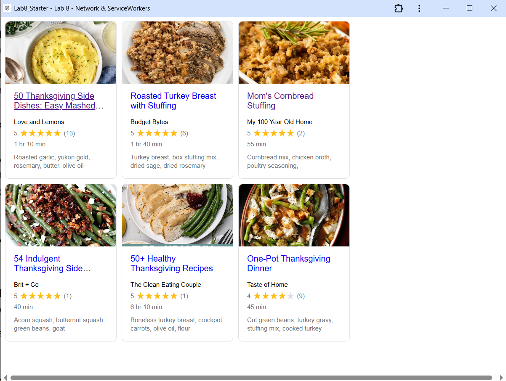

# Lab8-Starter
inchul kim
https://inchulkim95.github.io/Lab8_Starter/

Graceful degradation is a design idea where a web app can provide its core functionality even if some more advanced features are not supported by the browser being used. Service workers give some of those features like offline access and caching. if the browser doesnt like service workers though, the core function of the site will still work.

